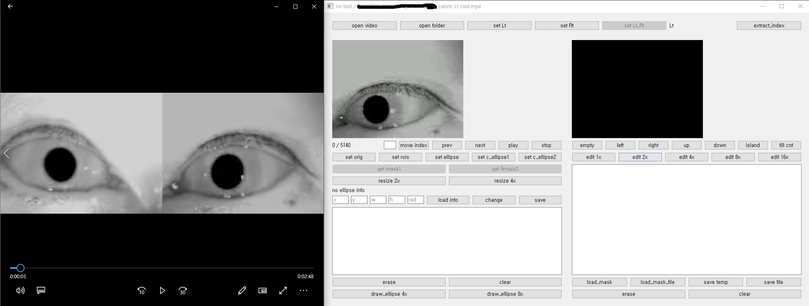
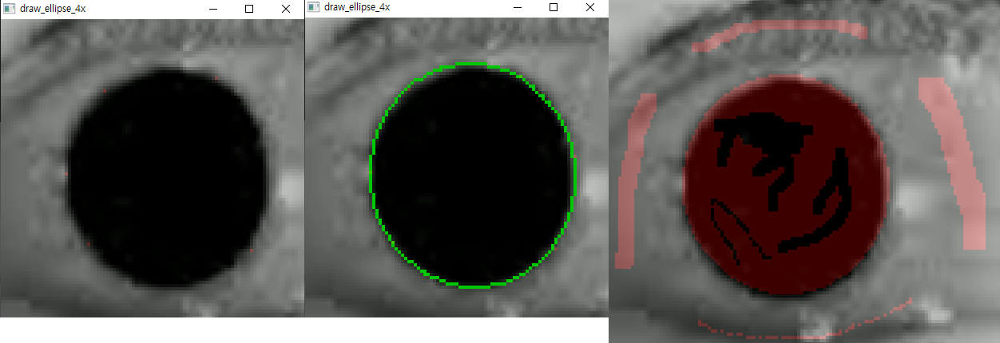
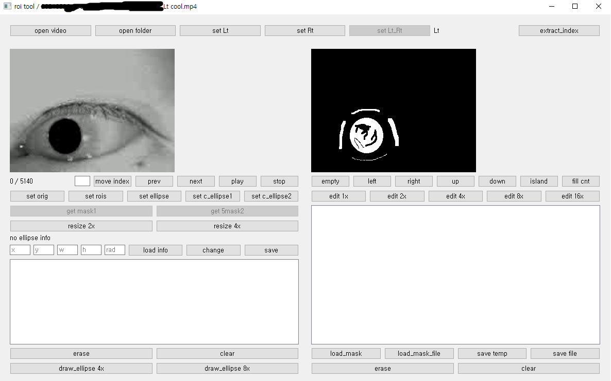
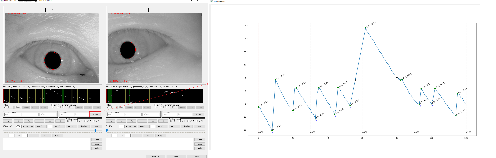

# nystagmus-tool

Since I made this tool to make my project easy for several weeks in a super hurry(ver 1.0, only takes 4 days), it's quite rough and raw.
You can see some of improvements to adopt type hint, multi threading, mvc patten etc.
I need to upgrade this tool left and right. 

Unluckly, this poor tool has been established to our roi team to make better results compare to previous one made by previous tool.
through this tool, it's easy to make roi with high resolution of selected area(x2 ~ x16) and able to modify it even single pixel.
and this also allow to see the eye-center-time-series movements graph with extracted center points (derived from U-net segmentation model).

easy to draw ellipse with some points and modify it on single pixel(or mass pixels) with high resolution 

it is also available to modify it after making mask.

there's sub window to find nystagmus quickly.
